# Doctor Schedule Management System

A desktop-based **Doctor Schedule Management System** developed using **C# Windows Forms** and **SQL Server**. The system helps manage doctor schedules, patient appointments, user roles, and public reviews in an organized way.

## Project Overview

In a healthcare environment, managing doctor schedules and patient appointments manually can be time-consuming and error-prone. Patients may face difficulty finding available doctors and booking appointments without schedule conflicts.

This application provides a structured platform where patients can view doctors, check available schedules, book appointments, and give reviews. Admins can manage doctors and schedules, while the Super Admin can monitor reviews and manage system-level actions.

## Technologies Used

- C#
- Windows Forms
- SQL Server
- ADO.NET
- Object-Oriented Programming

## User Roles

### Super Admin

- Log in to the system
- View doctors and users
- Monitor public reviews
- Remove doctors based on negative reviews
- Manage system-level operations

### Admin

- Log in to the system
- Add, update, and delete doctor information
- Manage doctor schedules
- View all appointments

### Patient / User

- Register and log in
- View available doctors
- Check doctor schedules
- Book appointments
- Give doctor reviews

## Main Features

- Role-based login system
- Patient registration
- Doctor information management
- Doctor schedule management
- Appointment booking
- Public review system
- Super Admin review monitoring
- SQL Server database integration
- CRUD operations
- Validation and verification of user inputs

## UI Navigation

The system navigation starts from the Login Form. New patients can register first and then log in. After login, users are redirected to different dashboards based on their roles.

```text
Register Form → Login Form

Login Form
├── Patient Dashboard
│   ├── View Doctors / Book Appointment
│   └── Give Doctor Review
│
├── Admin Dashboard
│   ├── Manage Doctors
│   └── Manage Schedule
│
└── Super Admin Dashboard
    ├── View Doctors
    └── Public Reviews / Remove Doctor
```

## UI Screenshots

### Login Form

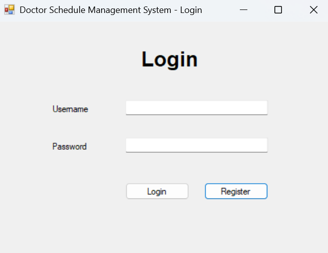

### Patient Registration

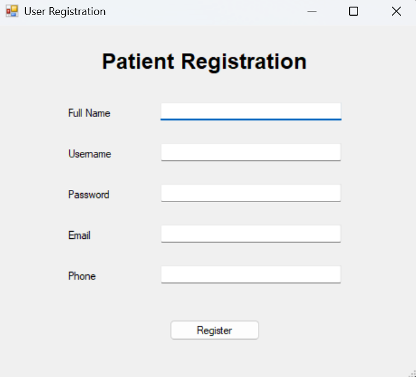

### Patient Dashboard

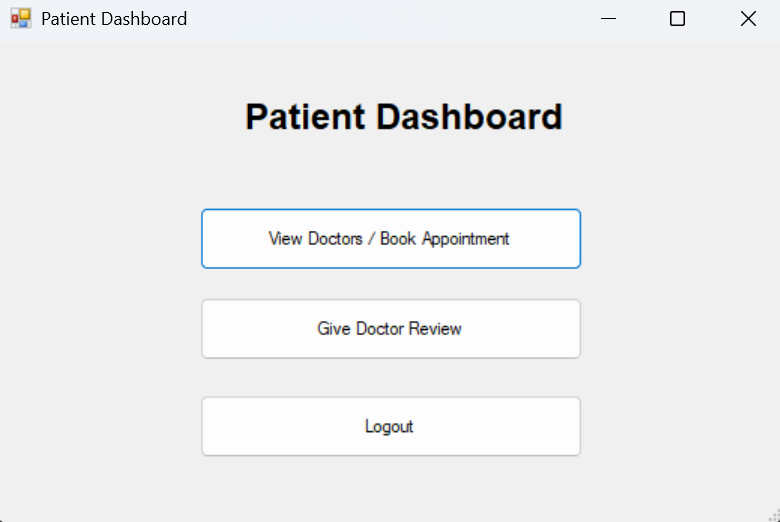

### View Doctors and Book Appointment

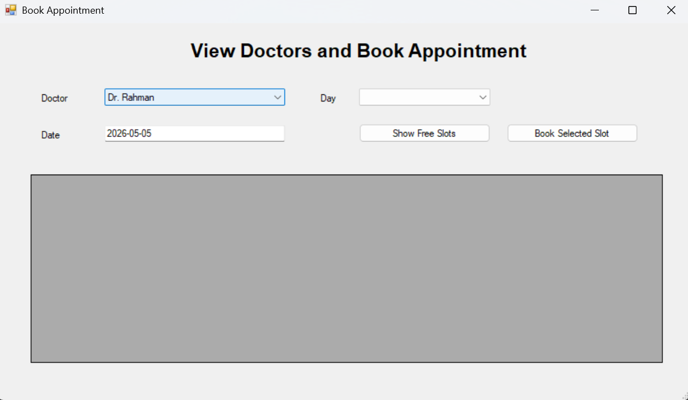

### Give Doctor Review

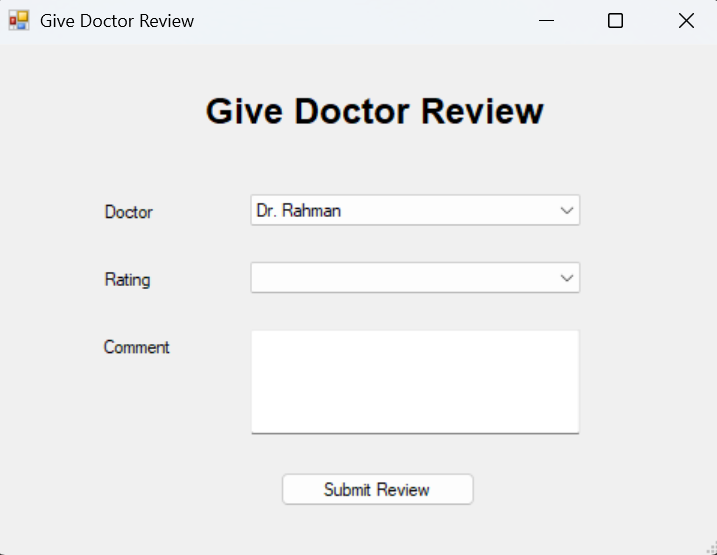

### Admin Dashboard

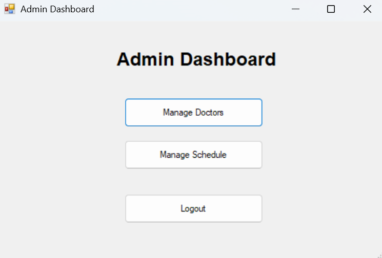

### Doctor Management

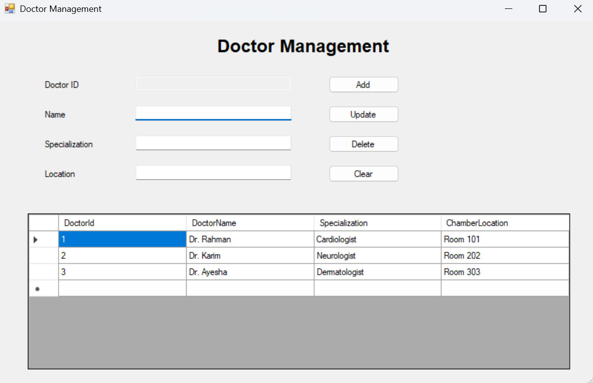

### Schedule Management

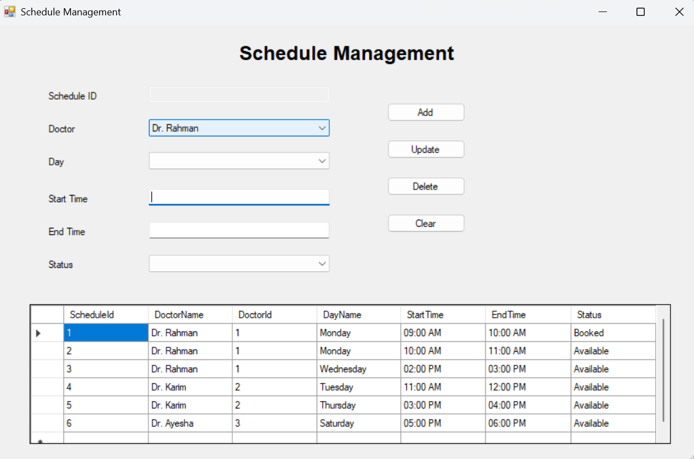

### Super Admin Dashboard

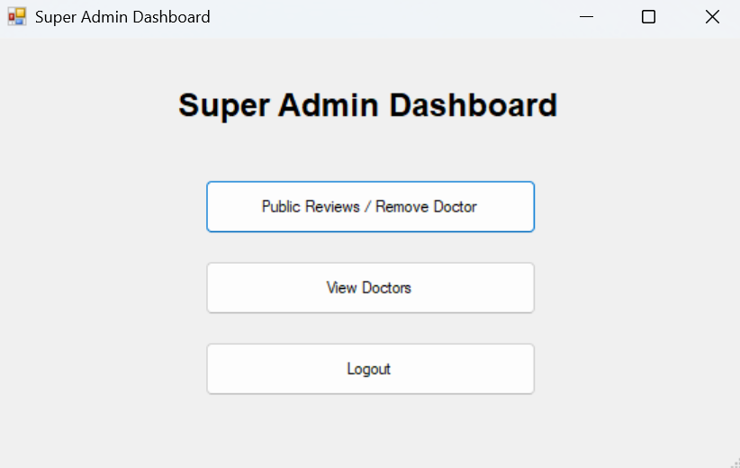

### Public Reviews

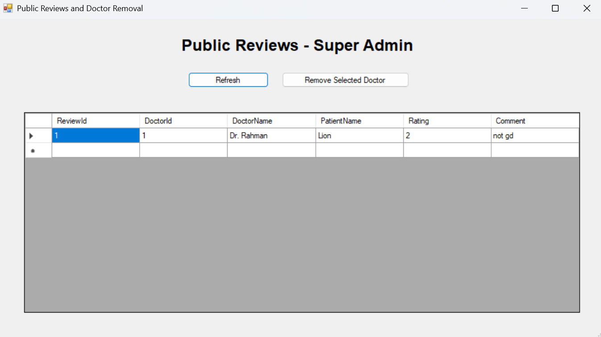

## ER Diagram

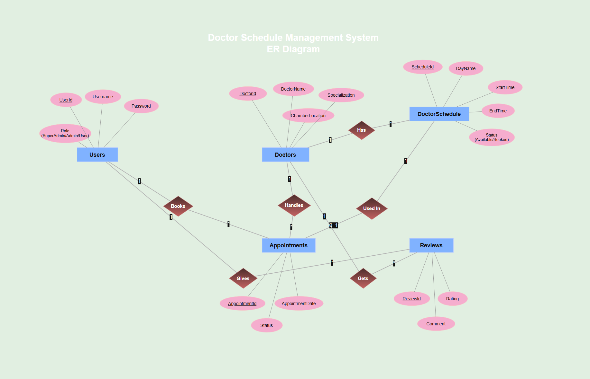

## Database Schema

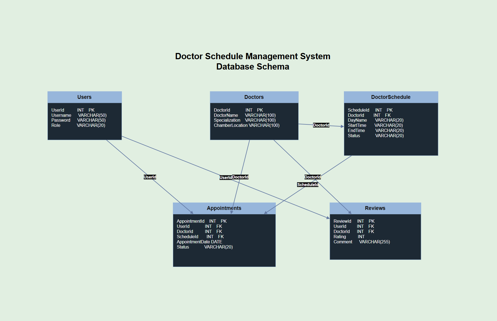

## Database Normalization

### Doctor Has Schedule

**UNF:**

```text
DoctorName, Specialization, Day, Time, Status
```

**1NF:**

```text
DoctorName, Specialization, Day, Time, Status
```

**2NF:**

```text
Doctor(DoctorId, DoctorName, Specialization)
DoctorSchedule(ScheduleId, DoctorId, Day, Time, Status)
```

**3NF:**

```text
Same as 2NF
```

### User Books Appointment

**UNF:**

```text
UserName, DoctorName, Date, Time, Status
```

**1NF:**

```text
UserName, DoctorName, Date, Time, Status
```

**2NF:**

```text
Users(UserId, Username, Password, Role)
Appointments(AppointmentId, UserId, DoctorId, Date, Time, Status)
```

**3NF:**

```text
Same as 2NF
```

### User Gives Review

**UNF:**

```text
UserName, DoctorName, Rating, Comment
```

**1NF:**

```text
UserName, DoctorName, Rating, Comment
```

**2NF:**

```text
Users(UserId, Username)
Reviews(ReviewId, UserId, DoctorId, Rating, Comment)
```

**3NF:**

```text
Same as 2NF
```

## Final Tables

1. Users
2. Doctors
3. DoctorSchedule
4. Appointments
5. Reviews

## Database Query

```sql
CREATE DATABASE DoctorScheduleDB;
USE DoctorScheduleDB;

CREATE TABLE Users (
    UserId INT PRIMARY KEY IDENTITY(1,1),
    Username VARCHAR(50),
    Password VARCHAR(50),
    Role VARCHAR(20)
);

CREATE TABLE Doctors (
    DoctorId INT PRIMARY KEY IDENTITY(1,1),
    DoctorName VARCHAR(100),
    Specialization VARCHAR(100),
    ChamberLocation VARCHAR(100)
);

CREATE TABLE DoctorSchedule (
    ScheduleId INT PRIMARY KEY IDENTITY(1,1),
    DoctorId INT,
    DayName VARCHAR(20),
    StartTime VARCHAR(20),
    EndTime VARCHAR(20),
    Status VARCHAR(20),
    FOREIGN KEY (DoctorId) REFERENCES Doctors(DoctorId)
);

CREATE TABLE Appointments (
    AppointmentId INT PRIMARY KEY IDENTITY(1,1),
    UserId INT,
    DoctorId INT,
    ScheduleId INT,
    AppointmentDate DATE,
    Status VARCHAR(20),
    FOREIGN KEY (UserId) REFERENCES Users(UserId),
    FOREIGN KEY (DoctorId) REFERENCES Doctors(DoctorId),
    FOREIGN KEY (ScheduleId) REFERENCES DoctorSchedule(ScheduleId)
);

CREATE TABLE Reviews (
    ReviewId INT PRIMARY KEY IDENTITY(1,1),
    UserId INT,
    DoctorId INT,
    Rating INT,
    Comment VARCHAR(255),
    FOREIGN KEY (UserId) REFERENCES Users(UserId),
    FOREIGN KEY (DoctorId) REFERENCES Doctors(DoctorId)
);
```

## Conclusion

The Doctor Schedule Management System provides an efficient desktop-based solution for managing doctor schedules and patient appointments. It supports multiple user roles, prevents appointment conflicts, and integrates database operations with a user-friendly Windows Forms interface.
