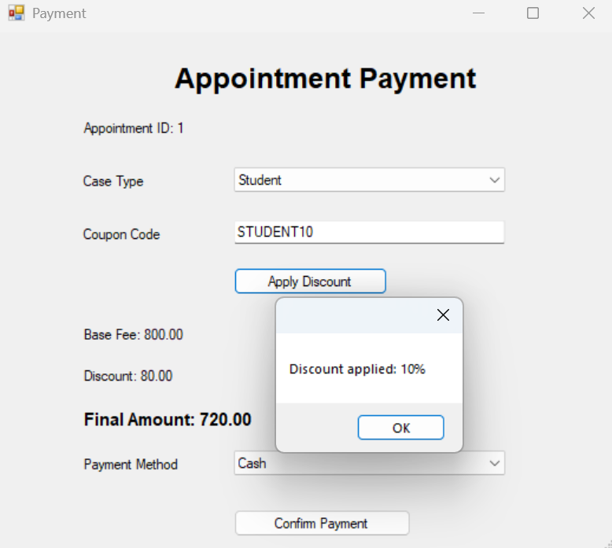
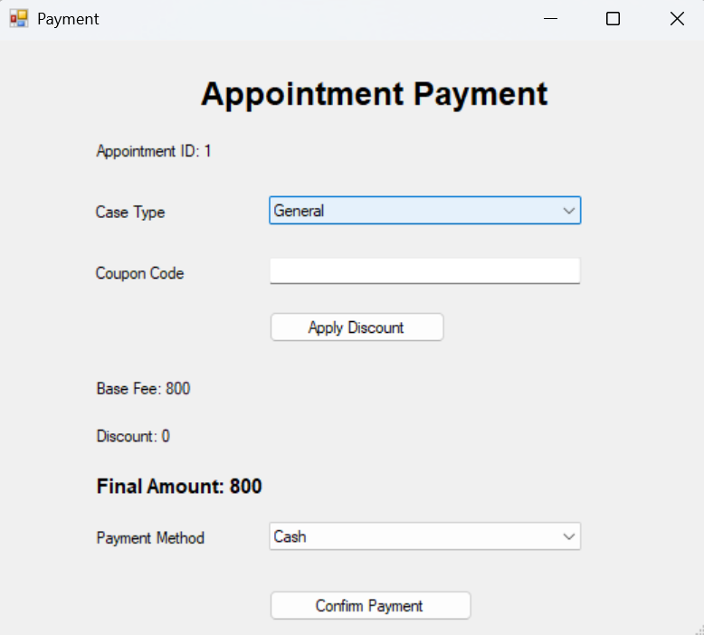
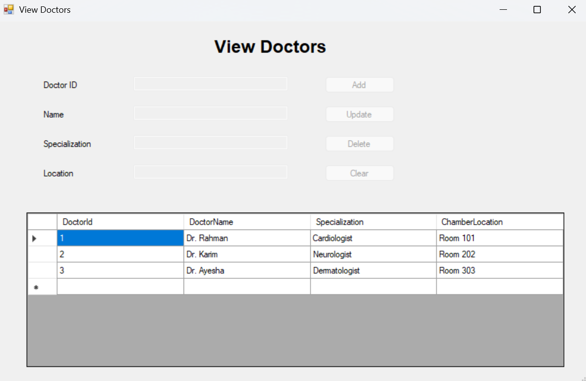

# Doctor Schedule Management System

A desktop-based **Doctor Schedule Management System** developed using **C# Windows Forms** and **SQL Server**. The application helps patients find available doctors, book appointments, complete payments, apply discount coupons or special case packages, and submit reviews. It also provides separate role-based access for **Super Admin**, **Admin**, and **Patient/User**.

## Project Overview

In many healthcare environments, doctor schedules, patient appointments, and payment records are managed manually. This can create appointment conflicts, delayed communication, and inaccurate payment tracking. This system provides a structured desktop application where patients can check doctor availability, book appointments, complete payment, and give feedback, while admins can manage doctors, schedules, appointments, and payment history.

## Key Features

- Role-based login system for Super Admin, Admin, and Patient/User
- Patient registration and login
- Doctor viewing and schedule checking
- Appointment booking with available time slots
- Appointment payment system
- Discount coupon and special package support
- Doctor review system
- Admin doctor management with add, update, and delete operations
- Admin schedule management
- Payment history and transaction monitoring
- Super Admin review monitoring and doctor removal based on negative feedback
- SQL Server database integration

## Technologies Used

| Technology | Purpose |
|---|---|
| C# | Application logic |
| Windows Forms | Desktop graphical user interface |
| SQL Server | Database management |
| ADO.NET | Database connectivity |
| Visual Studio | Development environment |
| draw.io / diagrams.net | ER diagram, database schema, and navigation diagram design |

## User Roles and Functionalities

### Super Admin

- Log in to the system
- View all doctors and users
- Monitor public reviews
- Remove doctors based on negative reviews
- View all payment transactions
- Manage system-level operations

### Admin

- Log in to the system
- Add, update, and delete doctor information
- Manage doctor schedules
- View all appointments
- View payment history

### Patient/User

- Register and log in
- View doctors
- Check available schedules
- Book appointments
- Complete appointment payments
- Apply discount coupons or special packages
- Give doctor reviews

## UI Navigation Flow

The system follows a role-based navigation structure. After logging in, users are redirected to their respective dashboard according to their role.

```text
Register Form
     ↓
Login Form
     ├── Patient Dashboard
     │      ├── View Doctors / Book Appointment
     │      ├── Appointment Payment
     │      └── Give Doctor Review
     │
     ├── Admin Dashboard
     │      ├── Manage Doctors
     │      ├── Manage Schedule
     │      └── View Payment History / Appointments
     │
     └── Super Admin Dashboard
            ├── Public Reviews / Remove Doctor
            └── View Doctors
```

## ER Diagram

The ER diagram represents the relationships among users, doctors, doctor schedules, appointments, reviews, payments, and coupons.


## Database Schema

The database schema contains the final normalized tables used in the system.


## Normalization Summary

### Doctor Has Schedule

- **UNF:** DoctorName, Specialization, Day, Time, Status
- **1NF:** DoctorName, Specialization, Day, Time, Status
- **2NF:**
  - Doctor(DoctorId, DoctorName, Specialization)
  - DoctorSchedule(ScheduleId, DoctorId, Day, Time, Status)
- **3NF:** Same as 2NF

### User Books Appointment

- **UNF:** UserName, DoctorName, Date, Time, Status
- **1NF:** UserName, DoctorName, Date, Time, Status
- **2NF:**
  - Users(UserId, Username, Password, Role)
  - Appointments(AppointmentId, UserId, DoctorId, Date, Time, Status)
- **3NF:** Same as 2NF

### User Gives Review

- **UNF:** UserName, DoctorName, Rating, Comment
- **1NF:** UserName, DoctorName, Rating, Comment
- **2NF:**
  - Users(UserId, Username)
  - Reviews(ReviewId, UserId, DoctorId, Rating, Comment)
- **3NF:** Same as 2NF

### Appointment Payment System

- **UNF:** UserName, DoctorName, Amount, CouponCode, Discount, FinalAmount, PaymentMethod
- **1NF:** UserName, DoctorName, Amount, CouponCode, Discount, FinalAmount, PaymentMethod
- **2NF:**
  - Appointments(AppointmentId, UserId, DoctorId, Date, Status)
  - Payments(PaymentId, AppointmentId, Amount, CouponCode, DiscountAmount, FinalAmount, PaymentMethod, PaymentStatus)
- **3NF:** Same as 2NF

### Coupon / Special Package

- **UNF:** CouponCode, Description, DiscountPercent, CaseType
- **1NF:** CouponCode, Description, DiscountPercent, CaseType
- **2NF:** Coupons(CouponId, CouponCode, Description, DiscountPercent, CaseType)
- **3NF:** Same as 2NF

## Final Database Tables

1. Users
2. Doctors
3. DoctorSchedule
4. Appointments
5. Reviews
6. Payments
7. Coupons

## SQL Database Query

```sql
CREATE DATABASE DoctorScheduleDB;
USE DoctorScheduleDB;

CREATE TABLE Users (
    UserId INT PRIMARY KEY IDENTITY(1,1),
    Username VARCHAR(50),
    Password VARCHAR(50),
    Role VARCHAR(20)
);

CREATE TABLE Doctors (
    DoctorId INT PRIMARY KEY IDENTITY(1,1),
    DoctorName VARCHAR(100),
    Specialization VARCHAR(100),
    ChamberLocation VARCHAR(100)
);

CREATE TABLE DoctorSchedule (
    ScheduleId INT PRIMARY KEY IDENTITY(1,1),
    DoctorId INT,
    DayName VARCHAR(20),
    StartTime VARCHAR(20),
    EndTime VARCHAR(20),
    Status VARCHAR(20),
    FOREIGN KEY (DoctorId) REFERENCES Doctors(DoctorId)
);

CREATE TABLE Appointments (
    AppointmentId INT PRIMARY KEY IDENTITY(1,1),
    UserId INT,
    DoctorId INT,
    ScheduleId INT,
    AppointmentDate DATE,
    Status VARCHAR(20),
    FOREIGN KEY (UserId) REFERENCES Users(UserId),
    FOREIGN KEY (DoctorId) REFERENCES Doctors(DoctorId),
    FOREIGN KEY (ScheduleId) REFERENCES DoctorSchedule(ScheduleId)
);

CREATE TABLE Reviews (
    ReviewId INT PRIMARY KEY IDENTITY(1,1),
    UserId INT,
    DoctorId INT,
    Rating INT,
    Comment VARCHAR(255),
    FOREIGN KEY (UserId) REFERENCES Users(UserId),
    FOREIGN KEY (DoctorId) REFERENCES Doctors(DoctorId)
);

CREATE TABLE Coupons (
    CouponId INT PRIMARY KEY IDENTITY(1,1),
    CouponCode VARCHAR(50),
    Description VARCHAR(150),
    DiscountPercent INT,
    CaseType VARCHAR(100)
);

CREATE TABLE Payments (
    PaymentId INT PRIMARY KEY IDENTITY(1,1),
    AppointmentId INT,
    Amount DECIMAL(10,2),
    CouponCode VARCHAR(50),
    CaseType VARCHAR(100),
    DiscountAmount DECIMAL(10,2),
    FinalAmount DECIMAL(10,2),
    PaymentMethod VARCHAR(50),
    PaymentStatus VARCHAR(20),
    FOREIGN KEY (AppointmentId) REFERENCES Appointments(AppointmentId)
);
```

## Application Screenshots

### Patient Registration


### Login Form


### Patient Dashboard


### View Doctors and Book Appointment


### Appointment Payment with Discount



### Appointment Payment



### Give Doctor Review


### Admin Dashboard


### Doctor Management


### Schedule Management


### View Doctors



### Super Admin Dashboard


### Public Reviews - Super Admin


## Project Outcome

The Doctor Schedule Management System provides an organized desktop solution for managing doctors, schedules, appointments, payments, coupons, and reviews. It reduces manual workload, prevents duplicate appointment booking, improves payment tracking, and offers role-based access for better system security and management.
